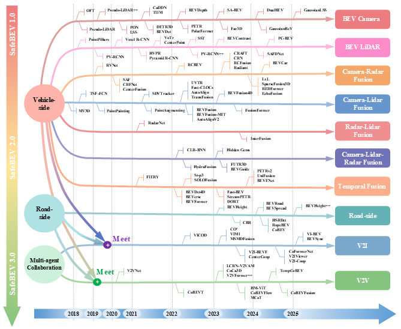

# BEV Camera  
This repository presents a curated collection of camera-only BEV perception methods in autonomous driving, with a focus on representative research papers and taxonomy-based summaries.  
🔍 Overview
Camera-only BEV perception methods aim to transform 2D images into spatially coherent BEV features that approximate the 3D structure of the driving environment. Compared to LiDAR-based solutions, camera-based approaches offer lower cost and broader scalability, but face significant challenges in depth reasoning and spatial alignment.
To better understand this evolving field, we categorize existing works along two key axes:  
📌Camera Configuration: Monocular and Multi-camera  
📌Feature Transformation Strategy:  
&nbsp;&nbsp;&nbsp;&nbsp;&nbsp;&nbsp;&nbsp;&nbsp;•3D-to-2D: Estimate intermediate 3D representations before BEV projection  
&nbsp;&nbsp;&nbsp;&nbsp;&nbsp;&nbsp;&nbsp;&nbsp;•2D-to-3D: Learn direct mappings from 2D images to BEV space  

## Monocular 
### 2D-to-3D Methods 
#### ``Pseudo-LiDAR'' methods.
• Pseudo-LiDAR from Visual Depth Estimation: Bridging the Gap in 3D Object Detection for Autonomous Driving / [paper](https://arxiv.org/abs/1812.07179) / [project](https://github.com/mileyan/pseudo_lidar/) / CVPR 2019 / Pseudo-LiDAR  
• Accurate Monocular Object Detection via Color-Embedded 3D Reconstruction for Autonomous Driving / [paper](https://arxiv.org/abs/1903.11444) / ICCV 2019 / AM3D  
• Are we Missing Confidence in Pseudo-LiDAR Methods for Monocular 3D Object Detection? / [paper](https://arxiv.org/abs/2012.05796) / ECCV 2020
#### Depth distributions methods.
• Orthographic Feature Transform for Monocular 3D Object Detection / [paper](https://arxiv.org/abs/1811.08188) / [project](https://github.com/tom-roddick/oft/) / arXiv / OFT  
• Categorical Depth Distribution Network for Monocular 3D Object Detection / [paper](https://arxiv.org/abs/2103.01100) / [project](https://github.com/TRAILab/CaDDN/) / CVPR 2021 / CaDDN  
### 3D-to-2D Methods
#### IPM-based methods.
• Inverse perspective mapping simplifies optical flow computation and obstacle detection / [paper](https://link.springer.com/article/10.1007/BF00201978) / Biological cybernetics / IPM  
• Automatic dense visual semantic mapping from street-level imagery / [paper](https://ieeexplore.ieee.org/document/6385958) / IROS 2012  
• Deep Learning based Vehicle Position and Orientation Estimation via Inverse Perspective Mapping Image / [paper](https://ieeexplore.ieee.org/document/8814050) / IV 2021  
#### MLP-based methods.
• Learning to Map Vehicles into Bird's Eye View / [paper](https://arxiv.org/abs/1706.08442) / [project](https://github.com/ndrplz/surround_vehicles_awareness/) / ICIPA 2017 / SDPN  
• Projecting Your View Attentively: Monocular Road Scene Layout Estimation via Cross-view Transformation / [paper](https://ieeexplore.ieee.org/document/9578824) / [project](https://github.com/JonDoe-297/cross-view/) / ICIPA 2017 / PYVA  
• BEV-LaneDet: a Simple and Effective 3D Lane Detection Baseline / [paper](https://arxiv.org/abs/2210.06006) / [project](https://github.com/AftermathK/cl_bev_lane_det/) / arXiv / BEV-LaneDet  
#### Transformer-based methods.
• Predicting Semantic Map Representations from Images using Pyramid Occupancy Networks / [paper](https://arxiv.org/abs/2003.13402) / [project](https://github.com/tom-roddick/mono-semantic-maps/) / arXiv / PON  
• Structured Bird's-Eye-View Traffic Scene Understanding from Onboard Images / [paper](https://arxiv.org/abs/2110.01997) / [project](https://github.com/ybarancan/STSU/) / ICCV 2021 / STSU  
• Translating Images into Maps / [paper](https://arxiv.org/abs/2110.00966) / [project](https://github.com/avishkarsaha/translating-images-into-maps/) / ICRA 2022 / TIIM  
• Bird's-Eye-View Panoptic Segmentation Using Monocular Frontal View Images / [paper](https://arxiv.org/abs/2108.03227) / [project](https://github.com/robot-learning-freiburg/PanopticBEV/) / RA-L 2022 / PanopticBEV  
• HFT: Lifting Perspective Representations via Hybrid Feature Transformation / [paper](https://arxiv.org/abs/2204.05068) / [project](https://github.com/JiayuZou2020/HFT/) / RA-L 2022 / HFT  

## Multi-camera  
### 2D-to-3D Methods
#### ``Pseudo-LiDAR'' methods.
• Pseudo-LiDAR point cloud magnification / [paper](https://www.sciencedirect.com/science/article/pii/S0925231220314569) / Neurocomputing
• Pseudo-LiDAR++: Accurate Depth for 3D Object Detection in Autonomous Driving / [paper](https://arxiv.org/abs/1906.06310) / [project](https://github.com/mileyan/Pseudo_Lidar_V2/) / ICLR 2020 / Pseudo-LiDAR++  
• End-to-End Pseudo-LiDAR for Image-Based 3D Object Detection / [paper](https://arxiv.org/abs/2004.03080) / [project](https://github.com/mileyan/pseudo-LiDAR_e2e/) / CVPR 2020 / E2E Pseudo-LiDAR  
• Accurate and Real-time Pseudo Lidar Detection: Is Stereo Neural Network Really Necessary? / [paper](https://arxiv.org/abs/2206.13858) / arXiv  
• Real-time Pseudo-LiDAR 3D object detection with geometric constraints / [paper](https://ieeexplore.ieee.org/document/9922503) / ITSC 2022  

#### Depth distributions methods.
• Lift, Splat, Shoot: Encoding Images From Arbitrary Camera Rigs by Implicitly Unprojecting to 3D / [paper](https://arxiv.org/abs/2008.05711) / [project](https://github.com/nv-tlabs/lift-splat-shoot/) / ECCV 2020 / LSS 
• BEVDet: High-performance Multi-camera 3D Object Detection in Bird-Eye-View / [paper](https://arxiv.org/abs/2112.11790) / [project](https://github.com/HuangJunJie2017/BEVDet/) / arXiv / BEVDet  
• BEVDepth: Acquisition of Reliable Depth for Multi-view 3D Object Detection / [paper](https://arxiv.org/abs/2206.10092) / [project](https://github.com/Megvii-BaseDetection/BEVDepth/) / AAAI 2023 / BEVDepth  
• MatrixVT: Efficient Multi-Camera to BEV Transformation for 3D Perception / [paper](https://arxiv.org/abs/2211.10593) / [project](https://github.com/ZRandomize/MatrixVT/) / arXiv / MatrixVT  

### 3D-to-2D Methods
#### MLP-based methods.
• NEAT: Neural Attention Fields for End-to-End Autonomous Driving / [paper](https://arxiv.org/abs/2109.04456) / [project](https://github.com/autonomousvision/neat/) / ICCV 2021 / NEAT  
• Cross-view Semantic Segmentation for Sensing Surroundings / [paper](https://arxiv.org/abs/1906.03560) / [project](https://github.com/pbw-Berwin/View-Parsing-Network/) / IROS 2020 / VPN  
• Robust Multi-Camera BEV Perception: An Image-Perceptive Approach to Counter Imprecise Camera Calibration / [paper](https://ieeexplore.ieee.org/document/10802840) / IROS 2024  

#### Transformer-based methods.
• LaRa: Latents and Rays for Multi-Camera Bird's-Eye-View Semantic Segmentation / [paper](https://arxiv.org/abs/2206.13294) / [project](https://github.com/valeoai/LaRa/) / CoRL 2022 / LaRa  
• DETR3D: 3D Object Detection from Multi-view Images via 3D-to-2D Queries / [paper](https://arxiv.org/abs/2110.06922) / [project](https://github.com/WangYueFt/detr3d/) / CoRL 2021 / DETR3D  
• PETR: Position Embedding Transformation for Multi-View 3D Object Detection / [paper](https://arxiv.org/abs/2203.05625) / [project](https://github.com/megvii-research/PETR/) / ECCV 2022 / PETR  
• Learning Ego 3D Representation as Ray Tracing / [paper](https://arxiv.org/abs/2206.04042) / [project](https://github.com/fudan-zvg/Ego3RT/) / ECCV 2022 / Ego3RT  
• Polar Parametrization for Vision-based Surround-View 3D Detection / [paper](https://arxiv.org/abs/2206.10965) / [project](https://github.com/hustvl/PolarDETR/) / arXiv / PolarDETR  
• PolarFormer: Multi-camera 3D Object Detection with Polar Transformer / [paper](https://arxiv.org/abs/2206.15398) / [project](https://github.com/fudan-zvg/PolarFormer/) / AAAI 2023 / PolarFormer  
• Graph-DETR3D: Rethinking Overlapping Regions for Multi-View 3D Object Detection / [paper](https://arxiv.org/abs/2204.11582) / [project](https://github.com/jlqzzz/Graph-DETR3D/) / ACM MM 2022 / Graph-DETR3D  
• CoBEVT: Cooperative Bird's Eye View Semantic Segmentation with Sparse Transformers / [paper](https://arxiv.org/abs/2207.02202) / [project](https://github.com/DerrickXuNu/CoBEVT/) / CoRL 2022 / CoBEVT  

new methods:  
• SA-BEV: Generating Semantic-Aware Bird's-Eye-View Feature for Multi-view 3D Object Detection / [paper](https://arxiv.org/abs/2307.11477) / [project](https://github.com/mengtan00/SA-BEV/) / ICCV 2023 / SA-BEV  
• Far3D: Expanding the Horizon for Surround-view 3D Object Detection / [paper](https://arxiv.org/abs/2308.09616) / [project](https://github.com/megvii-research/Far3D/) / AAAI 2024 / Far3D  
• DualBEV: Unifying Dual View Transformation with Probabilistic Correspondences / [paper](https://cn.overleaf.com/project/67519fe86a3c61d135f35be5) / [project](https://github.com/PeidongLi/DualBEV/) / ECCV 2024 / DualBEV  
• DA-BEV: Unsupervised Domain Adaptation for Bird's Eye View Perception / [paper](https://arxiv.org/abs/2401.08687) / [project](https://github.com/xdjiangkai/DA-BEV/) / ECCV 2024 / DA-BEV  
• GaussianBeV: 3D Gaussian Representation meets Perception Models for BeV Segmentation / [paper](https://arxiv.org/abs/2407.14108) / WACV 2025 / GaussianBeV  
• GaussianLSS - Toward Real-world BEV Perception: Depth Uncertainty Estimation via Gaussian Splatting / [paper](https://arxiv.org/html/2504.01957v1) / [project](https://github.com/HCIS-Lab/GaussianLSS/) / arXiv / GaussianLSS  

# BEV LiDAR  
In the context of BEV perception, LiDAR-only methods play a central role due to their accurate depth sensing capability and geometric fidelity. These approaches generally follow a two-step pipeline:  
Feature Extraction – Learning discriminative features from raw point clouds.  
BEV Transformation – Projecting features into the top-down BEV space to enable efficient reasoning and object localization.  
To better understand their design patterns, we categorize existing methods into two key types:  
📌Pre-BEV Methods: Extract features from raw 3D point clouds before projecting them into BEV space.  
📌Post-BEV Methods: First project raw data into BEV representation, then extract features directly from the 2D grid.

## Pre-BEV Methods  
### Voxel-based Methods  
• SECOND: Sparsely Embedded Convolutional Detection / [paper](https://www.mdpi.com/1424-8220/18/10/3337) / sensors / Second  
• Voxel R-CNN: Towards High Performance Voxel-based 3D Object Detection / [paper](https://arxiv.org/abs/2012.15712) / [project](https://github.com/djiajunustc/Voxel-R-CNN/) / AAAI 2021 / Voxel R-CNN  
• InfoFocus: 3D Object Detection for Autonomous Driving with Dynamic Information Modeling / [paper](https://arxiv.org/abs/2007.08556) / arXiv / InfoFocus  
• Voxel Transformer for 3D Object Detection / [paper](https://arxiv.org/abs/2109.02497) / [project](https://github.com/PointsCoder/VOTR/) / ICCV 2021 / VoTr  
• Embracing Single Stride 3D Object Detector with Sparse Transformer / [paper](https://arxiv.org/abs/2112.06375) / [project](https://github.com/catherine-lisa/SST_multisweeps/) / CVPR 2022 / SST  

#### Point-voxel-based Methods  
• PV-RCNN: Point-Voxel Feature Set Abstraction for 3D Object Detection / [paper](https://arxiv.org/abs/1912.13192) / [project](https://github.com/sshaoshuai/PV-RCNN/) / CVPR 2020 / PV-RCNN  
• PVGNet: A Bottom-Up One-Stage 3D Object Detector with Integrated Multi-Level Features / [paper](https://ieeexplore.ieee.org/document/9578803) / CVPR 2021 / PVGNet  
• PV-RCNN++: Point-voxel feature set abstraction with local vector representation for 3D object detection / [paper](https://link.springer.com/article/10.1007/s11263-022-01710-9) / IJCV 2023 / PV-RCNN++  
• HVPR: Hybrid Voxel-Point Representation for Single-stage 3D Object Detection / [paper](https://arxiv.org/abs/2104.00902) / [project](https://github.com/cvlab-yonsei/HVPR/) / CVPR 2021 / HVPR  
• Pyramid R-CNN: Towards Better Performance and Adaptability for 3D Object Detection / [paper](https://arxiv.org/abs/2109.02499) / [project](https://github.com/PointsCoder/Pyramid-RCNN/) / ICCV 2021 / Pyramid R-CNN  

## Post-BEV Methods  
• RT3D: Real-Time 3-D Vehicle Detection in LiDAR Point Cloud for Autonomous Driving / [paper](https://ieeexplore.ieee.org/document/8403277) / [project](https://github.com/zyms5244/RT3D/) / IROS 2018 / RT3D  
• PIXOR: Real-time 3D Object Detection from Point Clouds / [paper](https://arxiv.org/abs/1902.06326) / [project](https://github.com/philip-huang/PIXOR/) / CVPR 2018 / PIXOR  
• BirdNet: a 3D Object Detection Framework from LiDAR information / [paper](https://arxiv.org/abs/1805.01195) / ITSC 2018 / BirdNet  
• Complex-YOLO: Real-time 3D Object Detection on Point Clouds / [paper](https://arxiv.org/abs/1803.06199) / [project](https://github.com/AI-liu/Complex-YOLO/) / arXiv / Complex-YOLO  
• PointPillars: Fast Encoders for Object Detection From Point Clouds / [paper](https://ieeexplore.ieee.org/document/8954311) / [project](https://github.com/zhulf0804/PointPillars/) / CVPR 2019 / PointPillars  
• PillarNet: Real-Time and High-Performance Pillar-based 3D Object Detection / [paper](https://arxiv.org/abs/2205.07403) / [project](https://github.com/VISION-SJTU/PillarNet/) / ECCV 2022 / PillarNet  
• PolarNet: An Improved Grid Representation for Online LiDAR Point Clouds Semantic Segmentation / [paper](https://arxiv.org/abs/2003.14032) / [project](https://github.com/edwardzhou130/PolarSeg/) / CVPR 2020 / PolarNet  
• SalsaNet: Fast Road and Vehicle Segmentation in LiDAR Point Clouds for Autonomous Driving / [paper](https://arxiv.org/abs/1909.08291) / [project](https://github.com/aksoyeren/salsanet/) / arXiv / SalsaNet  
• CenterFormer: Center-based Transformer for 3D Object Detection / [paper](https://arxiv.org/abs/2209.05588) / [project](https://github.com/TuSimple/centerformer/) / ECCV 2022 / CenterFormer  
• Patch Refinement -- Localized 3D Object Detection / [paper](https://arxiv.org/abs/1910.04093) / NeurIPS 2019 / CoBEVT  
• HDNET: Exploiting HD Maps for 3D Object Detection / [paper](https://arxiv.org/abs/2012.11704) / CoRL 2018 / HDNet  

new methods:  
• FastPillars: A Deployment-friendly Pillar-based 3D Detector / [paper](https://arxiv.org/abs/2302.02367) / [project](https://github.com/StiphyJay/FastPillars/) / AAAI 2024 / FastPillars  
• SAFDNet: A Simple and Effective Network for Fully Sparse 3D Object Detection / [paper](https://arxiv.org/abs/2403.05817) / [project](https://github.com/zhanggang001/HEDNet/) / CVPR 2024 / SAFDNet  
• BEVContrast: Self-Supervision in BEV Space for Automotive Lidar Point Clouds / [paper](https://arxiv.org/abs/2310.17281) / [project](https://github.com/valeoai/BEVContrast/) / 3DV 2024 / BEVContrast  
• PC-BEV: An Efficient Polar-Cartesian BEV Fusion Framework for LiDAR Semantic Segmentation / [paper](https://arxiv.org/abs/2412.14821) / [project](https://github.com/skyshoumeng/PC-BEV/) / AAAI 2025 / PC-BEV  