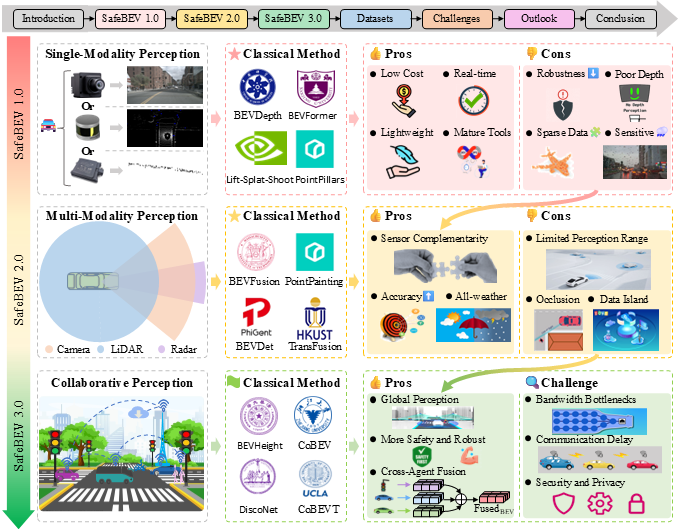

# 🛣️ Progressive BEV Perception for Safe Autonomous Driving

## 🚗 Introduction

This repo is associated with the survey paper "[Towards Safe and Robust Autonomous Driving: A Survey of Progressive Bird’s-Eye-View Perception]", which provides an up-to-date literature survey for BEV perception. We hope this repo can not only be a good starting point for new beginners but also help current researchers in the BEV perception community.
### 📌 Highlights

This repository complements the survey **"Towards Safe and Robust Autonomous Driving: A Survey of Progressive Bird’s-Eye-View Perception"**, which categorizes BEV perception into:
1. SafeBEV 1.0: Single-Modality Vehicle-Side Perception
2. SafeBEV 2.0: Multi-Modality Vehicle-Side Perception
3. SafeBEV 3.0: Multi-Agent Collaborative Perception
4. Datasets for BEV perception (onboard, V2X)

📚 [Read the Full Survey Paper (PDF)]()

📌 Keywords: Bird’s-Eye-View (BEV), autonomous driving, multi-modal sensor fusion, collaborative perception, safety and robustness, datasets

### 📌 Framework

This figure illustrates the evolution of Bird’s-Eye-View (BEV) perception across three key stages: single-modality vehicle-side perception (SafeBEV 1.0), multi-modality vehicle-side perception (SafeBEV 2.0), and multi-agent collaborative perception (SafeBEV 3.0). Each stage highlights representative sensor configurations, classical methods, as well as core advantages and challenges. The progression reflects increasing robustness, extended perception range, and improved collaboration capabilities, with a consistent focus on safety and real-world applicability in autonomous driving.

# SafeBEV Project Overview

Welcome to SafeBEV! Below are the main components of this project:

## 🔗 Sections

1. [SafeBEV 1.0: Single-Modality Vehicle-Side Perception](./01_SafeBEV1.0/SafeBEV1.0.md)
2. [SafeBEV 2.0: Multi-Modality Vehicle-Side Perception](./02_SafeBEV2.0/SafeBEV2.0.md)
3. [SafeBEV 3.0: Multi-Agent Collaborative Perception](./03_SafeBEV3.0/SafeBEV3.0.md)
4. [Datasets for BEV perception (onboard, V2X)](./04_Datasets/Datasets.md)