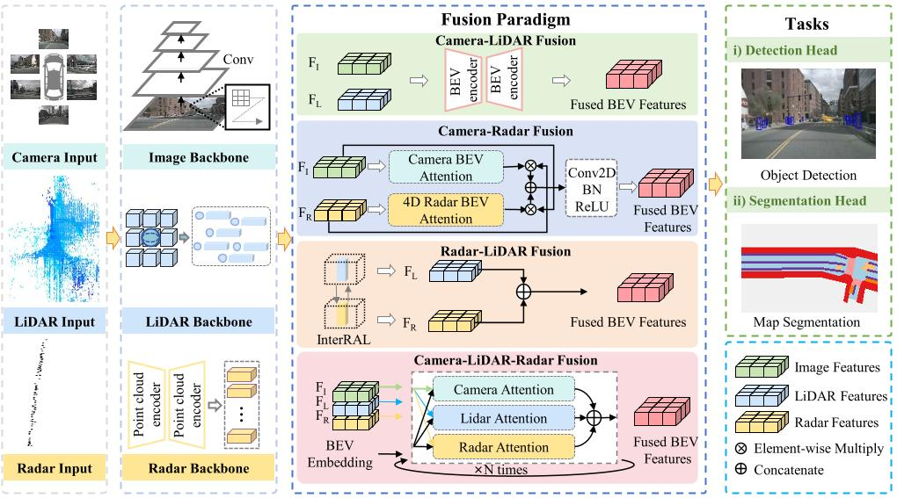

# SafeBEV 2.0: Multi-Modality Vehicle-Side Perception
Vehicle-side multi-modal BEV fusion perception constitutes a core architecture in autonomous driving systems, effectively mitigating the limitations of single-sensor modalities by integrating complementary strengths from multiple sensors, thereby substantially improving the robustness and safety of environmental perception.

*Figure: General pipeline of BEV fusion perception methods based on Camera, LiDAR, and Radar. The InterRAL module uses self-attention to fuse 4D Radar and 16-line LiDAR.*

In this section, we categorize existing approaches into five primary sensor fusion types: camera–radar, camera–LiDAR, radar–LiDAR, camera–LiDAR–radar fusion, and temporal fusion strategies. For each category, we further classify methods based on the number of fusion stages, distinguishing between single-stage and multi-stage fusion frameworks, and provide detailed analysis accordingly.

## Sensor Fusion Taxonomy

We categorize existing approaches into five primary sensor fusion types:

1. **Camera-Radar Fusion**
2. **Camera-LiDAR Fusion** 
3. **Radar-LiDAR Fusion**
4. **Camera-LiDAR-Radar Fusion**
5. **Temporal Fusion Strategies**

For each category, we further classify methods based on fusion stages:
- **Single-stage fusion**: End-to-end feature fusion
- **Multi-stage fusion**: Sequential or hierarchical fusion

## Camera-Radar Fusion
Cameras provide high-resolution semantic information, ideal for object recognition but degrade in low-visibility conditions. Millimeter-wave radar offers stable ranging in challenging environments but lacks perceptual richness. Thus, fusing both modalities enables robust vehicle perception.
### Single-stage fusion methods
- CRAFT: Camera-Radar 3D Object Detection with Spatio-Contextual Fusion Transformer / [paper](https://ojs.aaai.org/index.php/AAAI/article/view/25198) / AAAI 2023 / CRAFT 
- Crn: Camera radar net for accurate, robust, efficient 3d perception / [paper](https://openaccess.thecvf.com/content/ICCV2023/papers/Kim_CRN_Camera_Radar_Net_for_Accurate_Robust_Efficient_3D_Perception_ICCV_2023_paper.pdf) / ICCV 2023 / Crn
- Rcfusion: Fusing 4-d radar and camera with bird’s-eye view features for 3-d object detection / [paper](https://ieeexplore.ieee.org/abstract/document/10138035) / TIM 2023 / RCFusion
- Redformer: Radar enlightens the darkness of camera perception with transformers / [paper](https://ieeexplore.ieee.org/abstract/document/10310160) / TIV 2023 / REDFormer
### Multi-stage fusion methods
- A deep learning-based radar and camera sensor fusion architecture for object detection / [paper](https://arxiv.org/pdf/2005.07431) / [project](https://github.com/TUMFTM/CameraRadarFusionNet) / arXiv / CRFNet
- Centerfusion: Center-based radar and camera fusion for 3d object detection / [paper](https://openaccess.thecvf.com/content/WACV2021/papers/Nabati_CenterFusion_Center-Based_Radar_and_Camera_Fusion_for_3D_Object_Detection_WACV_2021_paper.pdf) / [project](https://github.com/mrnabati/CenterFusion) / WACV 2021 / CenterFusion
- RVNet: Deep sensor fusion of monocular camera and radar for image-based obstacle detection in challenging environments / [paper](https://www.researchgate.net/profile/Vijay-John/publication/335833918_RVNet_Deep_Sensor_Fusion_of_Monocular_Camera_and_Radar_for_Image-based_Obstacle_Detection_in_Challenging_Environments/links/5d7f164e92851c87c38b09f1/RVNet-Deep-Sensor-Fusion-of-Monocular-Camera-and-Radar-for-Image-based-Obstacle-Detection-in-Challenging-Environments.pdf) / PSIVT 2019 / RVNet
- RADIANT: Radar-image association network for 3D object detection / [paper](https://ojs.aaai.org/index.php/AAAI/article/view/25270) / [project](https://github.com/longyunf/radiant) / AAAI 2023 / RADIANT
- Bevcar: Camera-radar fusion for bev map and object segmentation / [paper](https://arxiv.org/pdf/2403.11761) / [project](https://bevcar.cs.uni-freiburg.de/) / IROS 2024 / Bevcar
- Bridging the view disparity between radar and camera features for multi-modal fusion 3d object detection / [paper](https://arxiv.org/pdf/2208.12079) / TIV 2023 / RCBEV
- SparseFusion3D: Sparse sensor fusion for 3D object detection by radar and camera in environmental perception / [paper](https://ieeexplore.ieee.org/abstract/document/10314799) / TIV 2023 / SparseFusion3D
- LXL: LiDAR excluded lean 3D object detection with 4D imaging radar and camera fusion / [paper](https://arxiv.org/pdf/2307.00724) / TIV 2023 / LXL
## Camera-Lidar Fusion
Images and LiDAR provide complementary information—images offer rich textures, while LiDAR delivers precise spatial data. Their effective fusion significantly boosts perception accuracy and robustness.
### Single-stage fusion methods
- Bevfusion: Multi-task multi-sensor fusion with unified bird's-eye view representation / [paper](https://arxiv.org/pdf/2205.13542) / [project](https://github.com/mit-han-lab/bevfusion) / ICRA 2023 / Bevfusion
- Bevfusion: A simple and robust lidar-camera fusion framework / [paper](https://proceedings.neurips.cc/paper_files/paper/2022/file/43d2b7fbee8431f7cef0d0afed51c691-Paper-Conference.pdf) / [project](https://github.com/ADLab-AutoDrive/BEVFusion) / NeurIPS 2022 / Bevfusion
- Unifying voxel-based representation with transformer for 3d object detection / [paper](https://proceedings.neurips.cc/paper_files/paper/2022/file/752df938681b2cf15e5fc9689f0bcf3a-Paper-Conference.pdf) / [project](https://github.com/dvlab-research/UVTR) / NeurIPS 2022 / UVTR
- FusionFormer: A Multi-sensory Fusion in Bird's-Eye-View and Temporal Consistent Transformer for 3D Object Detection / [paper](https://arxiv.org/pdf/2309.05257) / arXiv / FusionFormer
### Multi-stage fusion methods
- Multi-view 3d object detection network for autonomous driving / [paper](https://arxiv.org/pdf/2112.11790.pdf) / CVPR 2017 / MV3D
- Pointaugmenting: Cross-modal augmentation for 3d object detection / [paper](https://openaccess.thecvf.com/content/CVPR2021/papers/Wang_PointAugmenting_Cross-Modal_Augmentation_for_3D_Object_Detection_CVPR_2021_paper.pdf) / CVPR 2021 / Pointaugmenting
- Sdvtracker: Real-time multi-sensor association and tracking for self-driving vehicles / [paper](https://openaccess.thecvf.com/content/ICCV2021W/AVVision/papers/Gautam_SDVTracker_Real-Time_Multi-Sensor_Association_and_Tracking_for_Self-Driving_Vehicles_ICCVW_2021_paper.pdf) / ICCV 2021 / Sdvtracker
- Transfusion: Robust lidar-camera fusion for 3d object detection with transformers / [paper](https://openaccess.thecvf.com/content/CVPR2022/papers/Bai_TransFusion_Robust_LiDAR-Camera_Fusion_for_3D_Object_Detection_With_Transformers_CVPR_2022_paper.pdf) / CVPR 2022 / Transfusion
- Autoalign: Pixel-instance feature aggregation for multi-modal 3d object detection / [paper](https://arxiv.org/pdf/2201.06493) / arXiv / Autoalign
- Deformable feature aggregation for dynamic multi-modal 3D object detection / [paper](https://arxiv.org/pdf/2207.10316) / [project](https://github.com/zehuichen123/AutoAlignV2) / ECCV 2022 / AutoalignV2
- Bevfusion4d: Learning lidar-camera fusion under bird's-eye-view via cross-modality guidance and temporal aggregation / [paper](https://arxiv.org/pdf/2303.17099) / arXiv / Bevfusion4d
- Fast-CLOCs: Fast camera-LiDAR object candidates fusion for 3D object detection / [paper](https://openaccess.thecvf.com/content/WACV2022/papers/Pang_Fast-CLOCs_Fast_Camera-LiDAR_Object_Candidates_Fusion_for_3D_Object_Detection_WACV_2022_paper.pdf) / WACV 2022 / Fast-CLOCs

## Radar-Lidar Fusion
LiDAR provides high-resolution 3D geometric information essential for accurate object localization and mapping, but its performance degrades under adverse weather conditions, poor lighting, and at long distances due to point sparsity. In contrast, millimeter-wave radar is robust to such conditions and offers precise velocity estimation through the Doppler effect, making it suitable for dynamic and all-weather perception. The complementary characteristics of LiDAR and radar make their fusion highly beneficial for enhancing perception robustness. However, the high noise levels and low spatial resolution of radar introduce challenges in fusion, particularly with respect to spatial alignment and semantic consistency.
### Single-stage fusion methods
- Radarnet: Exploiting radar for robust perception of dynamic objects / [paper](https://arxiv.org/pdf/2007.14366) / ECCV 2020 / Radarnet
- InterFusion: Interaction-based 4D radar and LiDAR fusion for 3D object detection / [paper](https://www.researchgate.net/profile/Xinyu-Zhang-267/publication/366611396_InterFusion_Interaction-based_4D_Radar_and_LiDAR_Fusion_for_3D_Object_Detection/links/64472a9e8ac1946c7a4a13e8/InterFusion-Interaction-based-4D-Radar-and-LiDAR-Fusion-for-3D-Object-Detection.pdf) / IROS 2022 / InterFusion
### Multi-stage fusion methods
- InterFusion: Interaction-based 4D radar and LiDAR fusion for 3D object detection / [paper](https://www.researchgate.net/profile/Xinyu-Zhang-267/publication/366611396_InterFusion_Interaction-based_4D_Radar_and_LiDAR_Fusion_for_3D_Object_Detection/links/64472a9e8ac1946c7a4a13e8/InterFusion-Interaction-based-4D-Radar-and-LiDAR-Fusion-for-3D-Object-Detection.pdf) / IROS 2022 / InterFusion

## Camera-Lidar-Radar Fusion
With the rapid advancement of autonomous driving, the fusion of multimodal sensor data from cameras, LiDAR, and radar has become essential for enhancing perception accuracy and robustness. Each modality offers distinct advantages and suffers from inherent limitations. Therefore, well-designed fusion strategies are critical for achieving reliable performance in complex and dynamic environments.
### Single-stage fusion methods
- HydraFusion: Context-aware selective sensor fusion for robust and efficient autonomous vehicle perception / [paper](https://arxiv.org/pdf/2201.06644) / [project](https://github.com/AICPS/hydrafusion) / ICCPS 2022 / HydraFusion
- Futr3d: A unified sensor fusion framework for 3d detection / [paper](https://openaccess.thecvf.com/content/CVPR2023W/WAD/papers/Chen_FUTR3D_A_Unified_Sensor_Fusion_Framework_for_3D_Detection_CVPRW_2023_paper.pdf) / [project](https://tsinghua-mars-lab.github.io/futr3d/) / CVPR 2023 / Futr3d
- Bev-guided multi-modality fusion for driving perception / [paper](https://openaccess.thecvf.com/content/CVPR2023/papers/Man_BEV-Guided_Multi-Modality_Fusion_for_Driving_Perception_CVPR_2023_paper.pdf) / [project](https://yunzeman.github.io/BEVGuide/) / CVPR 2023 / BEVGuide
### Multi-stage fusion methods
- Camera, LiDAR, and radar sensor fusion based on Bayesian neural network (CLR-BNN) / [paper](https://ieeexplore.ieee.org/abstract/document/9721916/) / JSEN 2022 / CLR-BNN
- Hidden gems: 4d radar scene flow learning using cross-modal supervision / [paper](https://openaccess.thecvf.com/content/CVPR2023/papers/Ding_Hidden_Gems_4D_Radar_Scene_Flow_Learning_Using_Cross-Modal_Supervision_CVPR_2023_paper.pdf) / [project](https://github.com/Toytiny/CMFlow) / CVPS 2023 / Hidden gems

## Temporal Fusion Strategies
### Single-stage fusion methods.
- MotionNet: Joint Perception and Motion Prediction for Autonomous Driving Based on Bird's Eye View Maps / [paper](https://arxiv.org/abs/2003.06754) / [project](https://arxiv.org/abs/2003.06754/) / CVPR 2020 / MotionNet  
- FIERY: Future Instance Prediction in Bird's-Eye View from Surround Monocular Cameras / [paper](https://arxiv.org/abs/2104.10490) / [project](https://github.com/wayveai/fiery/) / ICCV 2021 / FIERY  
- BEVerse: Unified Perception and Prediction in Birds-Eye-View for Vision-Centric Autonomous Driving / [paper](https://arxiv.org/abs/2205.09743) / [project](https://github.com/zhangyp15/BEVerse/) / ITSC 2023 / BEVerse  
- BEVDet4D: Exploit Temporal Cues in Multi-camera 3D Object Detection / [paper](https://arxiv.org/abs/2203.17054) / [project](https://github.com/ChenControl/BEVDet4D/) / arXiv / BEVDet4D  
- Exploring Object-Centric Temporal Modeling for Efficient Multi-View 3D Object Detection / [paper](https://arxiv.org/abs/2303.11926) / [project](https://github.com/exiawsh/StreamPETR/) / ICCV 2023 / StreamPETR  
- Towards Efficient 3D Object Detection in Bird's-Eye-View Space for Autonomous Driving: A Convolutional-Only Approach / [paper](https://arxiv.org/abs/2312.00633) / ITSC 2023 / BEVENet  
### Multi-stage fusion methods.
- Enabling spatio-temporal aggregation in Birds-Eye-View Vehicle Estimation / [paper](https://ieeexplore.ieee.org/abstract/document/9561169) / [project](https://github.com/HCIS-Lab/GaussianLSS/) / ICRA 2021 / STA-ST  
- ST-P3: End-to-end Vision-based Autonomous Driving via Spatial-Temporal Feature Learning / [paper](https://arxiv.org/abs/2207.07601) / [project](https://github.com/OpenDriveLab/ST-P3/) / ECCV 2022 / ST-P3  
- Time Will Tell: New Outlooks and A Baseline for Temporal Multi-View 3D Object Detection / [paper](https://arxiv.org/abs/2210.02443) / [project](https://github.com/Divadi/SOLOFusion/) / CVPR 2025 / SOLOFusion  
- Fast-BEV: A Fast and Strong Bird's-Eye View Perception Baseline / [paper](https://arxiv.org/abs/2301.12511) / [project](https://github.com/Sense-GVT/Fast-BEV/) / TPAMI 2024 / Fast-BEV  
- BEVFormer: Learning Bird's-Eye-View Representation from Multi-Camera Images via Spatiotemporal Transformers / [paper](https://arxiv.org/abs/2203.17270) / [project](https://github.com/fundamentalvision/BEVFormer/) / ECCV 2022 / BEVFormer  
- PETRv2: A Unified Framework for 3D Perception from Multi-Camera Images / [paper](https://arxiv.org/abs/2206.01256) / [project](https://github.com/megvii-research/PETR/) / ICCV 2022 / PETRv2  
- UniFusion: Unified Multi-view Fusion Transformer for Spatial-Temporal Representation in Bird’s-Eye-View / [paper](https://ieeexplore.ieee.org/document/10376774) / [project](https://github.com/cfzd/UniFusion/) / ICCV 2023 / UniFusion  
- Monocular 3D Object Detection with Depth from Motion / [paper](https://arxiv.org/abs/2207.12988) / [project](https://github.com/Tai-Wang/Depth-from-Motion/) / ECCV 2022 / DfM  
- DORT: Modeling Dynamic Objects in Recurrent for Multi-Camera 3D Object Detection and Tracking / [paper](https://arxiv.org/abs/2303.16628) / [project](https://github.com/OpenRobotLab/DORT/) / arXiv / DORT  
